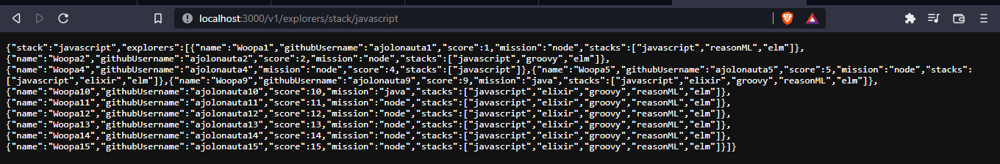

# FizzBuzz Contribution

Add new endpoint to get all the explorers with a specific stack.
The user can select wich stack wants to search.
Contains a test with jest to check if the function is working.
`npm test`

To run the server:
`npm run server`

| Endpoint | Request | Response |
|---|---|---|
| `localhost:3000/v1/explorers/stack/:stack` | `localhost:3000/v1/explorers/stack/javascript` | All explorers contains javascript in their stack |

```mermaid
graph TD;
    ExplorerService-->ExplorerController
    ExplorerController-->Server (New endpoint)
```

