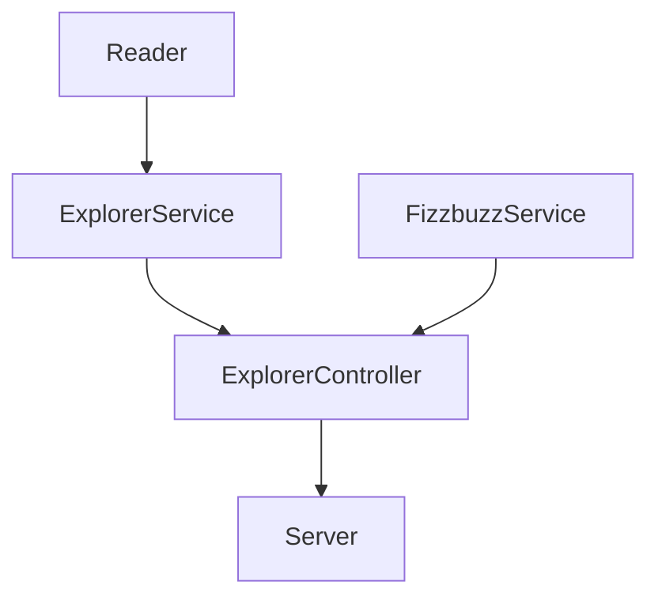

# Solicitud

Para esta modificacion se solicita:

Crea un endpoint nuevo que regrese toda la lista de explorers filtrados por un stack.

  - Ejemplo de url: `localhost:3000/v1/explorers/stack/javascript`.
  - Response: Todos los explorers que tengan en `stack` el valor recibido en la url: `javascript`. (este valor debe ser dinámico)

# Proceso

Se separa en 2 preparar el ambiente de desarrollo para ello se siguen los siguientes pasos:
  - Se agrega la dependencia de linter con el comando > npm install eslint --save-dev .
  - Se agrega la dependencia para test (jest) con el comando > npm install --save-dev jest .
  - Se agrega la dependencia de express para el server con el comando > npm install express --save .

El siguiente grafico representa el esquema actual de la solucion:

Una vez que se preparo el ambiente para la parte de desarrollo se hace lo siguiente:
  - Se agregan todas las pruebas unitarias para las clases existentes.
  - Tuve que hacer un cambio en el test.yml, ya que por alguna razón no corran las GitHub actions.
  - Se agrega el metodo getExplorersByStack en ExplorerController y ExplorerService con sus pruebas.
  - Se agrega el endpoint en server.js

# Resultado

Una vez hecho lo anterior, corrido las pruebas y haber corrido linter el resultado es el siguiente:

# Pendientes

Por alguna razon no me reconocio el .gitignore que agregara el package.json por lo que en mi git aun tengo el archivo como un cambio.
