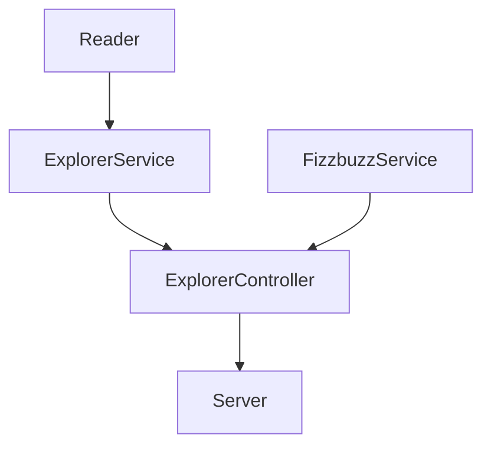
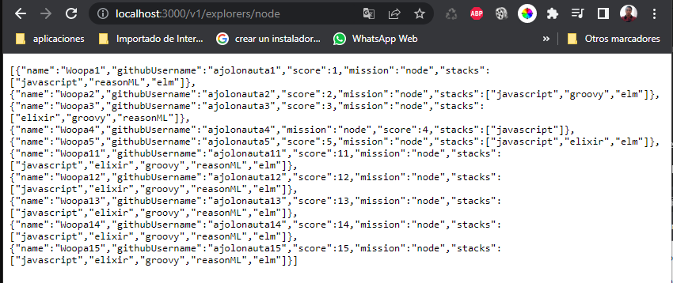
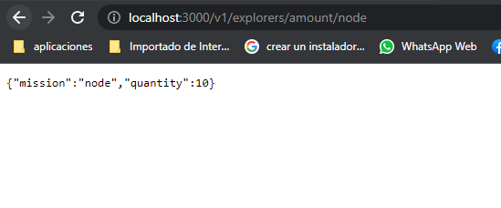
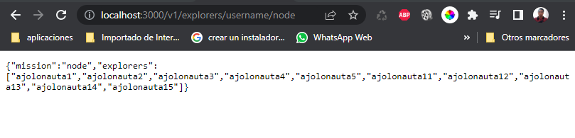
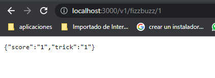
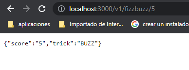
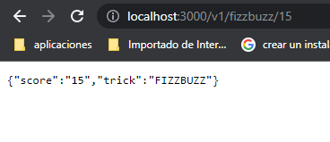
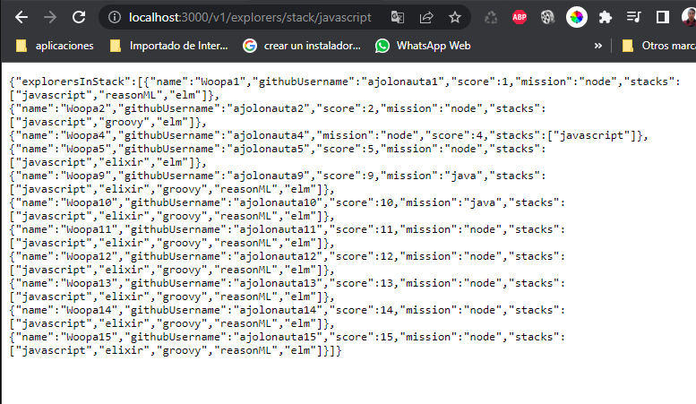

# FIZZBUZZ
El proyecto se trata de un Api de FizzBuzz, Donde se calcula cierta información de los explores de LaunchX.

## Puntos del proyecto:
1. Obtener la lista de explores que solo están en node.
2. Obtener la cantidad de explorers que están en node.
3. Obtener la lista de usuarios de GitHub de los explores que están en node.
4. Validación que se aplica tres reglas:
   - Si el campo score del explorer es divisible entre 3, entonces se agrega un campo nuevo llamdo `trick` cuyo valor será `FIZZ`.
   - Si el campo score del explorer es divisible entre 5, entonces se agrega un campo nuevo llamdo `trick` cuyo valor será `BUZZ`.
   - Si el campo score del explorer es divisible entre 3 y 5, entonces se agrega un campo nuevo llamdo `trick` cuyo valor será `FIZZBUZZ`.
   - Si el campo score no es divisible por ningun de las reglas anteriores, entonces se agrega un campo nuevo llamdo `trick` cuyo valor será el del score.

5. Api server con endpoints que utiliza la funcionalides antes mencionadas:
   - Obtiene la lista de explorers en la misión que se envie (node o java).
   - Obtiene la cantidad de explorers según la misión que se envie (node o java).
   - Obtiene la lista de usernames en la misión que se envie (node o java).
   - Obtiene la lista de explorers en el stack que se envie (node o java).
   - Recibe un número y aplica la validación del fizzbuzz.

## Diagrama como se comunica cada parte del proyecto.


## Como se llevo acabo el proyecto:
### 1.- Se crea el proyecto
1. Se creo la directorio `FIZZBUZZ` donde se guardara todo lo que necesitara el proyecto.
2. Se inicializa el proyecto con la versión de controles que es Git con el comando `git init`.
3. Se crea el repositorio en GitHub y luego vincularlo con el proyecto local, con los siguientes comandos git:
- ```
   git add origin "Aquí va el url del repo creado
   git remote -v
   git push origin master
   ```
4. Inicializar le proyecto con nodejs utilizando el siguiente comando:
- ```
   nmp init
   ```
5. Se crea el archivo `.gitignore` y dentro se escribe `**/node_modules` para que lo ignore y no versionarlo.
6. Instalar la dependencia `JEST` para hacer el test unitario una vez instalado agregas el siguiente script `"test": "node ./node_modules/jest/bin/jest.js` en el `package.json` , comando par instaler JEST es sig.
-  ```
   npm install --save--dev jest
   ```
### 2.- Se crea un archivo `explorers.json` donde contendra todo la información de cada unos de los explorers.
### 3.- Se crea test y el archivo Read.js para leer el archivo `explorers.json`.
1. Se crea el test `test/utils/Reader.test.js` y se ejucuta prueba unutaria:
- ```
   npm test test/utils/Reader.test.js
   ``` 
2. Se crea la estructura de donde se va alojar le archivo `Reader.js`, de la siguiente: `lib/utils/Reader.js` .
### 4.- Se crea test y el archivo ExplorerServices y sus métodos para obtener cierta información de los explorers.
1. Se crea el test `test/service/ExplorerService.test.js` y se ejecuta la prueba:
- ```
   npm test test/services/ExplorerService.test.js
   ```
2. Se crea el archivo `lib/services/ExplorerService.js`  y con su respectivo clase y métodos.
  - clase `ExplorerService`
  - Exporte de la clase: `module.exports = ExplorerService`
  - Métodos estaticos:
      * `filterByMssion`: Obtiene la lista de todos los explorers por la `mission`.
      * `getAmountOfExplorersByMission`: Obtiene la cantidad de explorers que se encuentrén en la `mission`.
      * `getExplorersUsernamesByMission`: Obtiene la lista de usuarios de GitHub de los explores que están en la `mission`.
      * `filterByStack`: obtiene la lista de todos los explorers por el `stack`.
### 5.- Se crea test y el archivo FizzbuzzServices y sus métodos para validar el fizzbuzz.
1. Se crea el test `test/service/FizzbuzzService.test.js` y se ejecuta la prueba:
- ```
   npm test test/services/FizzbuzzService.test.js
   ```
2. Se crea el archivo `lib/services/FizzbuzzService.js`  y con su respectivo clase y métodos.
- Clase: `Fizzbuzz`
- Exporte de la clase: `module.exports = FizzbuzzService`
- Méstos estaticos:
   * `ApplyValidationInExplorer`: Para validar el `score` y asignarle el `trick` dependiendo del `score` .
   * `applyValidationInNumber`: Para validar el número y devolver el `trick` dependiendo del `number` .
### 6.- Se crea test y el archivo ExplorerController y la clase y sus métodos .
1. Se crea el test `test/controllers/ExplorerController.test.js` y se ejecuta la prueba:
- ```
   npm test test/controllers/ExplorerController.test.js
   ```
2. Se crea el archivo `lib/Controllers/ExplorerController.js`  y con su respectivo clase y métodos.
- Clase: `ExplorerController`
- Exporte de la clase: `module.exports = ExplorerController`
- Importa las siguientes commandjs modules:
   * `const Reader = require("./../utils/Reader");`
   * `const ExplorerService = require("./../services/ExplorerService");`
   * `const FizzbuzzService = require("./../services/FizzbuzzService");`
- Méstos estaticos:
   * `getExplorersByMission`: Obtiene Los explorer por la mission.
   * `getExplorersUsernamesByMission`: Obtiene los username de los explorers por la mission.
   * `getExplorersAmounttByMission`: Obtiene la cantidad de los explorer por la mission.
   * `getValidationNumber`: utliza el metodo fizzbuzz y valida el numero y dvuleve un valor.
   * `getExplorersfilterByStack`: Obtiene los explorer por el  stack.

## Automatización pruebas con GitHub Action
1. Se crea el archivo: `.github/workflows/test.yml`
 - contenido que tiene que llevar el archivo:
   * ```
      name: Run Tests in my project every push on GitHub

      on: push
      jobs:
      test:
         runs-on: ubuntu-latest
         steps:
            - uses: actions/checkout@v2
            - name: Setup Node.js
            uses: actions/setup-node@v1
            with:
               node-version: "12"

            # Speed up subsequent runs with caching
            - name: Cache node modules
            uses: actions/cache@v2
            env:
               cache-name: cache-node-modules
            with:
               # npm cache files are stored in `~/.npm` on Linux/macOS
               path: ~/.npm
               key: ${{ runner.os }}-build-${{ env.cache-name }}-${{ hashFiles('**/package-lock.json') }}
               restore-keys: |
                  ${{ runner.os }}-build-${{ env.cache-name }}-
                  ${{ runner.os }}-build-
                  ${{ runner.os }}-

            # Install required deps for action
            - name: Install Dependencies
            run: npm install

            # Finally, run our tests
            - name: Run the tests
            run: npm test
     ```
Cada ves que realices un commit el GitHub Accion se va ejecutar en repositorio remoto, si vas en el apartado Action ahi veras si paso el test o no si está con el palomita ver si paso el test, si la palomita esta en roja esque no pasomel test.

# Isntalación de Linter
Está herramienta nos ayudara a cuidar la legibilidad en nuestro código.

1. Instalacion ESLint en tu proyecto
 - ```
   npm install eslint --save-dev
   ```
2. Ejecuta el comando para generar la configuración del linter
 - ```
   npm init @eslint/config
   ```
   en la consola se mostrar las isguientes preguntas:
   * primera pregunta: `How would you like to use ESlinter?`, selecciones la opción `To check syntax and find problems`
   * segunda pregunta: `What type of modules does your project use?`, seleccione la opción `CommonJS (require/exports)`
   * tercer pregunta: `Which framework does your project use?`, seleccione la opción `None of these`
   * cuarta pregunta: `Does your project use Tyscript?`, seleccione la opción `No`
   * quinta pregunta: `Where does your code run?`, seleccione la opción `Browser`
   * sexta pregunta: `What format do you want your config files to be in?`, seleccione la opción `Javascript`
3. Una ves instalado se crea un archivo `.eslintrc.js` y dentro vamos a agregar lo siguiente que son los roles.
 - ```
   module.exports = {
      "env": {
        "browser": true,
        "commonjs": true,
        "es2021": true,
        "jest": true
      },
      "extends": "eslint:recommended",
      "parserOptions": {
        "ecmaVersion": "latest"
      },
      "rules": {
        indent: ["error", 4],
        "linebreak-style": ["error", "unix"],
        quotes: ["error", "double"],
        semi: ["error", "always"]
      }
   };
   ```
   Los rules son reglas que podemos decirle al Linter que revise en nuestros archivos, nos ayudan a detectar mejoras de escritura.

4. En el `package.json` escribimos el siguiente script:
- ```
   "linter": "node ./node_modules/eslint/bin/eslint.js .",
    "linter-fix": "node ./node_modules/eslint/bin/eslint.js . --fix"
  ```
5. Ejecutamos linter para que nos diga cuales son las insconsistencia de nuestro codigo:
 - ```
   npm run linter
   ```
6. El Linter arregla todos estos detalles por ti. Corre npm run linter-fix y tus archivos ahora quedarán con el mejor formato.
- ```
   run linter-fix
   ```
## Creación API Server en express.
### Instalación de express
1. Se crea el archivo `lib/server.js`
2. Instalación de Express en el proyecto con comando:
- ```
  npm install express --save
  ```
3. En package.json se agrega el siguiente script: `"server": "node ./lib/server.js"`
4. Para levantar el servidor se ejeuta el siguiente comando:
 - ```
   npm run server
   ```
## Se crea un server básico
1. Se crea un server básico de esta forma:
 - ```
   const ExplorerController = require("./controllers/ExplorerController");
   const express = require("express");
   const app = express();
   app.use(express.json());
   const port = 3000;

   app.get("/", (request, response) => {
      response.json({message: "FizzBuzz Api welcome!"});
   });

   app.listen(port, () => {
      console.log(`FizzBuzz API in localhost:${port}`);
   });
   ```
2. Levantar el server, abrir un explorador y escribir el siguiente url: `localhost:3000`
 - 

## Creación de endpoint para el server
Se utliza el método `GET` que va a devolver información cuando se consulte.
### Primer Endpoint
1. Endpoint que recibe un parámetro por query params, y regresar la lista de explorers filtrados por el parámetro.
 - Endpoint:
   * `/v1/explorers/:mission`
 - Request:
   * `localhost:3000/v1/explorers/node`
 - Response: Deberás obtener la lista de explorers en la misión que enviaste (node o java).
2. Asi es como se muestra una vez que se levanta el server:
 - 
### Segundo Endpoint
1. Endpoint que regresa la cantidad de explorers según la misión que se envíe.
 - Endpoint:
   * `localhost:3000/v1/explorers/amount/:mission`
 - Request:
   * `localhost:3000/v1/explorers/amount/node`
 - Response: Deberás obtener la cantidad de explorers según la misión que enviaste (node o java).
 2. Asi es como se muestra una vez que se levanta el server:
 - 
### Tercer Endpoint
1. Endpoint que regresa la lista de usernames de los explorers filtrados por la misión.
 - Endpoint:
   * `localhost:3000/v1/explorers/usernames/:mission`
 - Request:
   * `localhost:3000/v1/explorers/username/node`
 - Response:Deberá obtener la lista de usernames en la misión que enviaste (node o java).
 2. Asi es como se muestra una vez que se levanta el server:
 - 
### Cuarto Endpoint
1. Endpoint que recibe un número y aplica la validación del fizzbuzz.
 - Endpoint:
   * `localhost:3000/v1/fizzbuzz/:score`
 - Request:
   * `localhost:3000/v1/fizzbuzz/1`
 - Response:Deberá obtener la validación del score que enviaste.
 2. Asi es como se muestra una vez que se levanta el server:
 - Con el score 1, trick 1 
      * 
 - Con el score 3, trick FIZZ
      * 
 - Con el score 5, trick BUZZ
      * 
 - Con el score 15, trick FIZZBUZZ
      * 
### Quinto Endpoint
1. Endpoint que recibe un parámetro por query params, y regresar la lista de explorers filtrados por el stack.
 - Endpoint:
   * `/v1/explorers/stack/:stack`
 - Request:
   * `/v1/explorers/stack/javascript`
 - Response: Deberá obtener la lista de explorers en el stack que enviaste (javascript).
 2. Asi es como se muestra una vez que se levanta el server:
 - 

