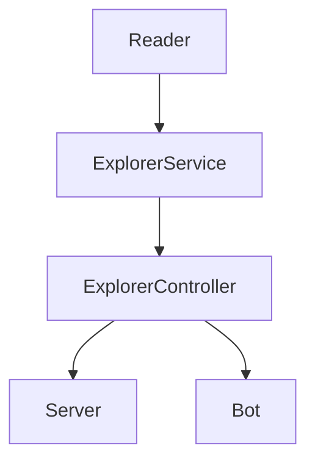

# FizzBuzz Backend con API y Telegram Bot

Este proyecto es una demostración de backend con la finalidad de obtener ciertos datos de una base de datos sencilla en formato json y de determinar el estado de un número dado. Esto puede ser consultado mediante una API por peticiones web o bien por medio de un bot de Telegram.

Se encuentra modularizado en los siguientes apartados, interconectados entre sí:



Es decir, el controller es nuestro enlace entre la funcionalidad de la aplicación y el acceso ya sea por medio de la API o por medio del bot. Este se encarga de obtener los datos desde el archivo json y de enviarlos para su uso a la clase ExplorerService:

```javascript
//Ejemplo de una función que toma los datos y los envía para su procesamiento
static getExplorersByMission(mission){
  const explorers = Reader.readJsonFile("explorers.json");
  return ExplorerService.filterByMission(explorers, mission);
}
```

El objetivo de esta aplicación es poder obtener la siguiente información:

1. Obtener una lista de explorers dada una misión por medio de la petición http a la API.
2. Obtener la cantidad de explorers que se encuentran en una determinada misión (API).
3. Obtener una lista de usernames de los explorers que se encuentran en una determinada misión (API).
4. Obtener una lista de usernames de los explorers que cuentan con cierta materia en su stack (API).
5. Obtener una lista de nombres de los explorers que se encuentran en una determinada misión (Bot).
6. Devolver el status de un número dado por medio de las siguientes condiciones (por medio de API y Bot):
  - Si el número es divisible entre 3 y entre 5 a la vez, devuelve la cadena FIZZBUZZ.
  - Si el número solo es divisible entre 3, devuelve FIZZ.
  - Si el número solo es divisible entre 5, devuelve BUZZ.
  - Si el número no entra en ninguna de las condiciones anteriores, devuelve el mismo número.

Para realizar los primeros 4 requerimientos, se hace uso de unas funciones en la clase ExplorerService:

```javascript
    static filterByMission(explorers, mission){
        const explorersByMission = explorers.filter((explorer) => explorer.mission == mission);
        return explorersByMission;
    }

    static getAmountOfExplorersByMission(explorers, mission){
        const explorersByMission = ExplorerService.filterByMission(explorers, mission);
        return explorersByMission.length;
    }

    static getExplorersUsernamesByMission(explorers, mission){
        const explorersByMission = ExplorerService.filterByMission(explorers, mission);
        const explorersUsernames = explorersByMission.map((explorer) => explorer.githubUsername);
        return explorersUsernames;
    }
    static filterByStack(explorers, name){
        const explorersWithStack = explorers.filter((explorer) => explorer.stacks.includes(name));
        return explorersWithStack;
    }
```

# Evidencia de funcionamiento

1. Requerimiento 1


2. Requerimiento 2


3. Requerimiento 3


4. Requerimiento 4


El quinto requerimiento también se encuentra dentro de esta clase, pero dado que la entrada es el número en el mensaje recibido, y la salida debe ser la cadena de respuesta que dará el bot, la funcionalidad cambia un poco con respecto a los anteriores; esta función determinará si la consulta devuelve un resultado o si no, y se lo informará al usuario:

```javascript
    static botExplorersByMission(explorers, mision){
        let responseBot = "";
        const explorersByMission = ExplorerService.filterByMission(explorers, mision);
        const explorersNames = explorersByMission.map((explorer) => explorer.name);
        const explorersNamesWithSpaces = explorersNames.toString().split(', ').join(',').split(',').join(', ');
        if (explorersNamesWithSpaces === ""){
            responseBot = `No hay explorers con misión ${mision}`;
        } else {
            responseBot = `Explorers en la misión ${mision}: ${explorersNamesWithSpaces.toString()}`;
        }
        return responseBot;
    }
```

# Evidencia de funcionamiento

1. Requerimiento 5


Por último, el sexto requerimiento debe poderse consultar tanto desde la API como desde el bot de Telegram. Para el primer caso, la funcionalidad de este está en una clase llamada FizzbuzzService, el cual contiene la siguiente lógica para poder cumplir con las condiciones que solicita el requerimiento:

```javascript
    static applyValidationInNumber(number){
        if(number % 3 === 0  && number % 5 === 0){
            return "FIZZBUZZ";
        } else if(number % 3 === 0) {
            return "FIZZ";
        } else if(number % 5 === 0) {
            return "BUZZ";
        }else{
            return number;
        }
    }
```

# Evidencia de funcionamiento

1. Requerimiento 6


Y para el caso del bot de Telegram, este solo recibirá el número por medio de un mensaje, y deberemos entonces responder con la validación correspondiente. Esta lógica se encuentra en la misma clase que el caso anterior:

```javascript
    static botFizzBuzz(number){
        let calificacion = "";
        if(number % 3 === 0  && number % 5 === 0){
            calificacion = "FIZZBUZZ";
        } else if(number % 3 === 0) {
            calificacion = "FIZZ";
        } else if(number % 5 === 0) {
            calificacion = "BUZZ";
        }else{
            calificacion = number;
        }
        const responseBot = `Tu número es: ${number}. Validación: ${calificacion}`;
        return responseBot;
    }
```

De esta forma, validamos el número entrante, revisamos el caso en donde cae, y devolvemos al bot un mensaje con la cadena correspondiente al caso.

# Evidencias de funcionamiento

1. Requerimiento 6


Nota: Cabe destacar en este último caso que el requerimiento solicitaba en un inicio que, cualquier cadena entrante que no fuera número, devolviera un mensaje solicitando una entrada válida (razón por la cual en la captura anterior se aprecia dicho mensaje cuando se envía la cadena "Casa", por ejemplo). Esto fue descartado al recibir el nuevo requerimiento de que la validación FIZZBUZZ también formara parte del refactoring para el bot de Telegram, por lo que ahora cualquier cadena de texto entrante, la tratará como una misión a la cual deberá devolver el listado de explorers inscritos en ella.
