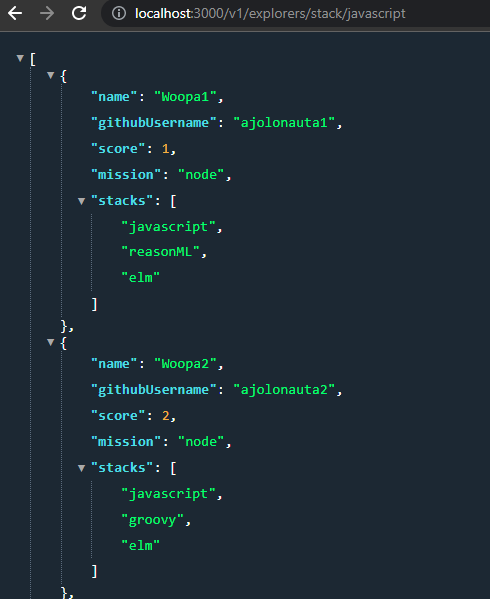

# Contribución Open Source

1. Instalamos las dependencias necesarias para el proyecto con el siguiente comando:
```
npm i
```

2. Se creó el método `getExplorersByStacks` en el archivo ExplorerService.js, dicho método recibe dos parámetros (explorers y stacks). Dentro del método se hace uso del método filter para así poder filtrar a los usuarios dependiendo de sus stack.

```
static getExplorersByStacks (explorers, stack){
        const explorersByStack = explorers.filter((explorer) => explorer.stacks.includes(stack));
        return explorersByStack;
    }
```

3. Antes de continuar se realizarón las pruebas de unidad para el método creado en el paso anterior, las pruebas se ubican en el archivo ExplorerService.test.js. Para las pruebas se utilizo el archivo de explorers.json el cuál contiene la lista de explorers asi que se importo la clase Reader:
```
const Reader = require("../../lib/utils/reader");
```
* Después, se creó una constante llamada explorers para poder hacer uso de la clase importada en el paso anterior y como parámetro se envía el archivo de explorers.json:
```
const explorers = Reader.readJsonFile("explorers.json");
```

* En el caso de las pruebas se realizaron dos test, uno para verificar si se recibía la lista de explorers con el stack "javascript" y el otro para verificar la cantidad de explorers con el mismo stack. Dando como resultado:


4. En el archivo ExplorerController.js, se creó un método llamado `getExplorersByStack` y recibe un parámetro llamado stack. Al crear este método se permite extender un puente entre la funcionalidad y el server. El método queda de la siguiente manera:
```
static getExplorersByStack(stack){
        const explorers = Reader.readJsonFile("explorers.json");
        return ExplorerService.getExplorersByStacks(explorers, stack);
    }
```
5. Por último, en el archivo `server.js`, se creó el nuevo endpoint solicitado que regresa toda la lista de explorers filtrados por un stack.
```
app.get("/v1/explorers/stack/:stack", (request, response) => {
    const stack = request.params.stack;
    const explorersStacks = ExplorerController.getExplorersByStack(stack);
    response.json(explorersStacks);
});
```
## Resultado

Se puede verificar en el navegador si se obtiene respuesta al buscar a los explorers por stack:



Por último, se corre el comando `npm run linter-fix`, con ellos los archivos quedarán con el formato definido en las reglas que se establecieron en la guía de estilo (Linter).
